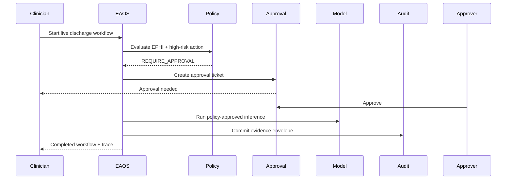

# EAOS Pilot Runbook

## Pilot Profile

- Name: Hospital Discharge Readiness Assistant
- Goal: Assist discharge planning while enforcing policy gates for high-risk actions
- Tenant: `tenant-starlight-health`
- Data sensitivity: `EPHI`

## What the Pilot Demonstrates

1. Model routing with zero-retention requirements
2. Policy decisioning (`ALLOW`, `DENY`, `REQUIRE_APPROVAL`)
3. Human approval gating before risky outbound actions
4. Immutable audit/evidence generation
5. Simulation and live execution modes

## Demo Flow



## Start the Pilot Locally

```bash
npm install
npm run build
npm run smoke:pilot
```

Optional explicit demo output:

```bash
node tools/scripts/pilot-demo.mjs
```

## Regenerate Screenshots

Use Playwright CLI with a running gateway (`:3000`) and admin console (`:4273`):

```bash
npx --yes --package @playwright/cli playwright-cli -s=eaosshots open http://127.0.0.1:4273/dashboard
# ...navigate route-by-route...
npx --yes --package @playwright/cli playwright-cli -s=eaosshots screenshot --full-page --filename docs/assets/screenshots/dashboard-pilot.png
```

## Pilot UI Walkthrough

1. Open the console at `http://127.0.0.1:4273/dashboard` and click **Connect demo sessions**.
2. In **Simulation Lab**, run one simulation pass to baseline behavior.
3. Run **Run live workflow** from dashboard or simulation to create a pending approval.
4. Switch to the **Security** persona and open **Approval Inbox**.
5. Approve or reject the selected item and verify status/evidence update in **Audit Explorer**.
6. Open **Incident Review Explorer** to inspect derived incident records.

## Screenshot Gallery

- Dashboard: `docs/assets/screenshots/dashboard-pilot.png`
- Admin Console: `docs/assets/screenshots/admin-console.png`
- Security Console: `docs/assets/screenshots/security-console.png`
- Agent Builder: `docs/assets/screenshots/agent-builder.png`
- Workflow Designer: `docs/assets/screenshots/workflow-designer.png`
- Approval Inbox: `docs/assets/screenshots/approval-inbox.png`
- Incident Review: `docs/assets/screenshots/incident-review.png`
- Audit Explorer: `docs/assets/screenshots/audit-explorer.png`
- Simulation Lab: `docs/assets/screenshots/simulation-lab.png`

## Demo Artifact

- Machine-readable report: `docs/assets/demo/pilot-demo-output.json`

## Success Criteria

- Live run blocks pending approval
- Approval changes run state to completed
- Audit log includes workflow + approval events
- Evidence references are present in audit output
